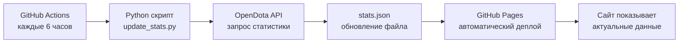

# 🌐 Flipmixplay's Personal Website

<div align="center">


**Мой личный уголок в интернете** — статический сайт с автоматической статистикой Dota 2, мультиязычностью и стильным дизайном.

[🌍 Посетить сайт](https://flipmixplay.github.io/flipmixplay-site/) · [💬 Оставить комментарий](https://flipmixplay.github.io/flipmixplay-site/#comments) · [📊 Мой OpenDota](https://www.opendota.com/players/840785563)

</div>

---

##  Возможности

| Фича | Описание |
|------|----------|
|  **Статистика Dota 2** | Автоматическое обновление ранга, винрейта и любимого героя каждые 6 часов |
| 🌍 **Мультиязычность** | Поддержка EN/RU с автоопределением языка браузера |
| 💬 **Комментарии** | Интеграция с Utterances (GitHub Issues) |
| 🎨 **Стильный дизайн** | Темная тема с голубыми акцентами в стиле OpenDota |
| 📱 **Адаптивность** | Отлично выглядит на всех устройствах |
| ⚡ **Быстрая загрузка** | Статический сайт без тяжелых фреймворков |
| 🤖 **Автоматизация** | GitHub Actions для обновления данных |

---

## 🖼️ Превью

<div align="center">


*Темный дизайн с эффектом glassmorphism и анимациями*

</div>

---

## 🛠️ Технологический стек

### Frontend
- **HTML5** — семантическая разметка
- **CSS3** — кастомные стили с CSS Variables, Grid, Flexbox
- **JavaScript (ES6+)** — интерактивность и локализация
- **Font Awesome** — иконки
- **Google Fonts (Inter)** — типографика

### Backend & Automation
- **GitHub Pages** — хостинг
- **GitHub Actions** — CI/CD для обновления статистики
- **Python** — скрипт для работы с OpenDota API
- **OpenDota API** — источник данных о Dota 2

### Интеграции
- **Utterances** — система комментариев через GitHub Issues
- **OpenDota** — статистика Dota 2

---

##  Структура проекта

```
flipmixplay-site/
├── 📄 index.html          # Главная страница
├── 🎨 style.css           # Все стили сайта
├── 🌍 i18n.js             # Система локализации (EN/RU)
├── 📊 script.js           # Загрузка и отображение статистики
├── 🐍 update_stats.py     # Python скрипт для OpenDota API
├── 📦 stats.json          # Кэш статистики (генерируется автоматически)
├── 🖼️ avatar.jpg          # Аватар профиля
└── 📂 .github/
    └── workflows/
        └── update-stats.yml  # GitHub Actions workflow
```

---

## 🚀 Быстрый старт

### Требования
- Аккаунт GitHub
- Базовые знания HTML/CSS/JS (опционально)

### Установка

1. **Форкните репозиторий**
   ```bash
   git clone https://github.com/Flipmixplay/flipmixplay-site.git
   cd flipmixplay-site
   ```

2. **Настройте GitHub Pages**
   - Перейдите в **Settings** → **Pages**
   - Выберите ветку `main` и папку `/ (root)`
   - Нажмите **Save**

3. **Настройте GitHub Actions**
   - Откройте `.github/workflows/update-stats.yml`
   - Измените `STEAM_ID` в файле `update_stats.py` на ваш Steam ID
   - Закоммитьте изменения

4. **Настройте комментарии (Utterances)**
   - Создайте публичный репозиторий для комментариев
   - Установите приложение [Utterances](https://github.com/apps/utterances)
   - Обновите `repo` в `index.html`

5. **Откройте сайт!**
   ```
   https://ваш-username.github.io/flipmixplay-site/
   ```

---

## ⚙️ Как работает автоматизация



### Workflow
1. **Каждые 6 часов** запускается GitHub Actions
2. Python скрипт запрашивает данные у OpenDota API
3. Данные сохраняются в `stats.json`
4. GitHub Pages автоматически деплоит изменения
5. Сайт показывает актуальную статистику

---

## 🌍 Локализация

Сайт поддерживает два языка с автоматическим определением:

| Язык | Код | Автоопределение |
|------|-----|-----------------|
| 🇬🇧 English | `en` | По умолчанию |
| 🇷🇺 Русский | `ru` | Если браузер на русском |

### Добавление нового языка

1. Откройте `i18n.js`
2. Добавьте новый объект в `translations`:
   ```javascript
   fr: {
       subtitle: "Bienvenue dans mon coin personnel du web!",
       // ... остальные переводы
   }
   ```
3. Добавьте кнопку в `index.html`:
   ```html
   <button class="lang-btn" data-lang="fr">FR</button>
   ```

---

## 🎨 Кастомизация

### Изменение цветовой схемы

Откройте `style.css` и измените CSS переменные:

```css
:root {
    --primary-color: #00d2ff;      /* Основной цвет */
    --secondary-color: #0078ff;    /* Вторичный цвет */
    --bg-gradient: linear-gradient(135deg, #0f2027, #203a43, #2c5364);
}
```

### Изменение аватара

Замените файл `avatar.jpg` в корне репозитория на ваше изображение.

### Добавление новых ссылок

В `index.html` найдите секцию `.links-container` и добавьте:

```html
<a href="https://ваша-ссылка.com" target="_blank" class="link-card">
    <i class="fab fa-название-иконки icon"></i>
    <span class="text">Название</span>
    <i class="fas fa-arrow-right arrow"></i>
</a>
```

---

## 📊 Статистика Dota 2

Сайт автоматически отображает:
- **Ранг** (например, "Crusader 3" / "Рыцарь 3")
- **Винрейт** (процент побед)
- **Любимый герой** (самый играемый)

Данные обновляются каждые 6 часов через [OpenDota API](https://docs.opendota.com/).

---

##  Вклад в проект

Приветствуются любые улучшения! Вот как помочь:

1. **Форкните** репозиторий
2. **Создайте ветку** для фичи (`git checkout -b feature/AmazingFeature`)
3. **Закоммитьте** изменения (`git commit -m 'Add AmazingFeature'`)
4. **Запушьте** ветку (`git push origin feature/AmazingFeature`)
5. **Откройте Pull Request**

---

## 📝 Лицензия

Этот проект распространяется под лицензией MIT. Подробнее в файле [LICENSE](LICENSE).

---

## 📬 Контакты

- **GitHub**: [@Flipmixplay](https://github.com/Flipmixplay)
- **Steam**: [flipmixplay](https://steamcommunity.com/id/flipmixplay/)
- **Discord**: [Профиль](https://discord.com/users/581012692744011776)
- **YouTube**: [@flipmixplay](https://www.youtube.com/@flipmixplay)
- **Dota 2**: [OpenDota](https://www.opendota.com/players/840785563)

---

<div align="center">

### ⭐ Если вам понравился проект, поставьте звезду!

**Сделано с ❤️ и большим количеством Dota 2**

[⬆️ Вернуться наверх](#-flipmixplays-personal-website)

</div>
```

---

## 📋 Как использовать:

1. Создай файл `README.md` в корне репозитория
2. Скопируй весь код выше
3. Замени placeholder ссылку на скриншот на реальную (можешь сделать скриншот своего сайта и загрузить его в папку `images/`)
4. Закоммить и запушь:
   ```bash
   git add README.md
   git commit -m "Add beautiful README"
   git push
   ```

## 🎨 Что включено:

✅ **Бейджи** — GitHub Pages, языки, API, лицензия  
✅ **Таблица возможностей** — все фичи в одном месте  
✅ **Превью** — место для скриншота сайта  
✅ **Технологический стек** — что использовалось  
✅ **Структура проекта** — визуальное дерево файлов  
✅ **Инструкция по установке** — пошаговый гайд  
✅ **Диаграмма работы** — как работает автоматизация (Mermaid)  
✅ **Гайд по локализации** — как добавить новый язык  
✅ **Кастомизация** — как менять цвета, аватар, ссылки  
✅ **Раздел вклада** — для тех, кто хочет помочь  
✅ **Контакты** — все твои ссылки  
✅ **Эмодзи и форматирование** — для красоты  
